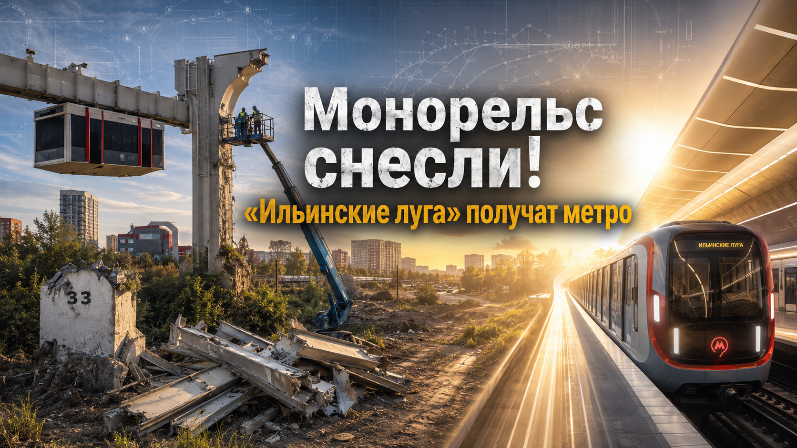
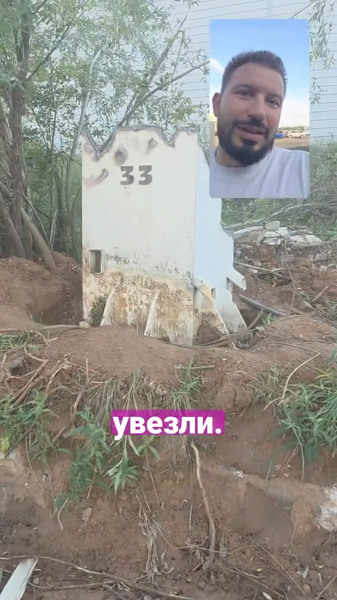
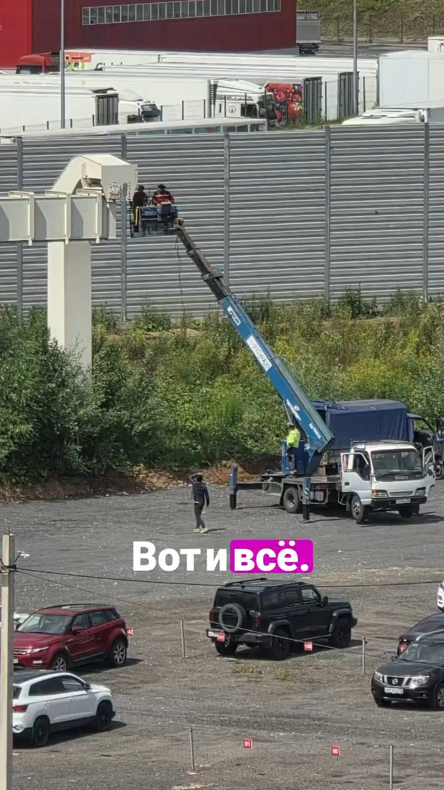
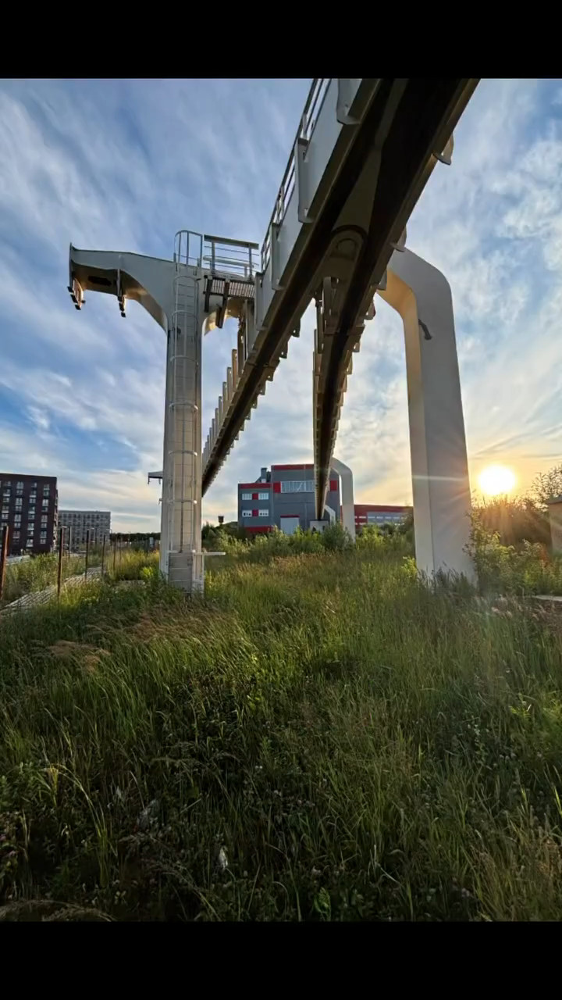
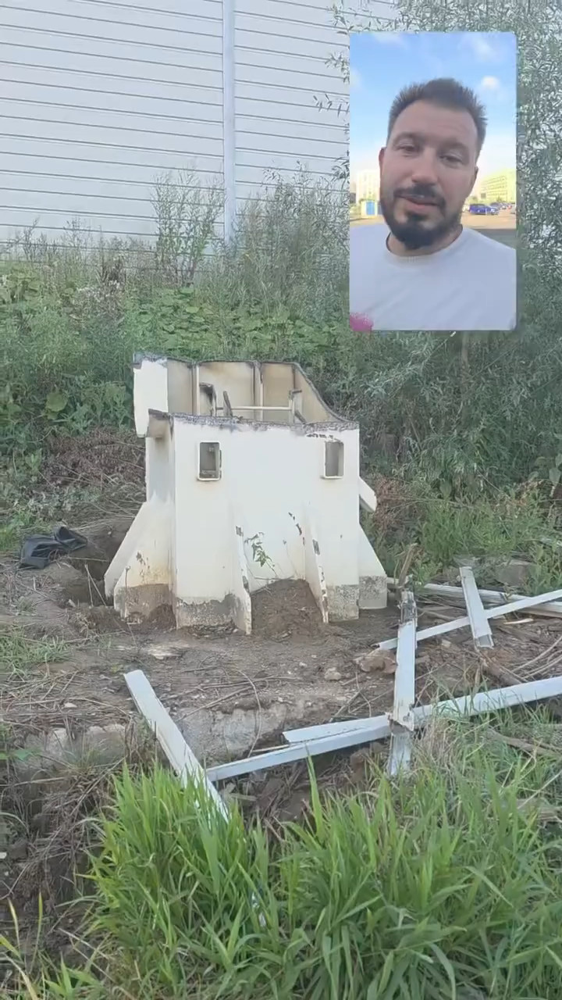

# Монорельс снесли — метро уже строят: почему «Стрела» у «Ильинских лугов» стала не концом, а сменой транспортной эпохи

*Июль 2026 года. Путевой балки уже нет. Но транспортное будущее Новой Риги не исчезло вместе с ней: в том же направлении строится Рублёво-Архангельская линия метро.*

В июле 2026 года у ЖК **«Ильинские луга»** исчез объект, который почти десять лет дразнил жителей Новой Риги одним вопросом: *а вдруг всё-таки поедет?*

Не поехал.

Белые балки подвесного монорельса **«Стрела»** сняли автокраном. Опоры разрезали. Металл погрузили на машины. Автор приложенного видео сообщает, что освободившуюся площадку собираются использовать для расширения парковки.[^1]

Первый вывод напрашивается сам: железо, которое должно было поднять людей над пробкой, само уехало по дороге — на грузовике.

Только это не вся история.

Пока у «Ильинских лугов» резали старую эстакаду, на Рублёво-Архангельской линии уже работали проходческие щиты. Станцию **«Новорижская»** строят между Ильинским шоссе и 23-м километром Новорижского шоссе. Московский стройкомплекс относит её к участку, который планируют ввести в 2027 году.[^13]

Получается редкий транспортный парадокс. На поверхности заканчивается частный эксперимент с подвесным вагоном. Под землёй и на строительных площадках набирает ход государственная линия полноценного метро.

Не кладбище будущего. Смена масштаба.

Почему один проект остался белой эстакадой возле жилого комплекса, а другой уже связывает в единую систему «Москва-Сити», северо-запад столицы и Красногорск? Что погубило «Стрелу»: технология, смена собственника, разрыв финансирования или сама идея строить общественный транспорт силами девелопера? И мог ли опыт московского «лёгкого метро» подтолкнуть город и область к более тяжёлому, зато сетевому решению?

Ответ сложнее привычного крика «миллиард распилили». Здесь не один виноватый болт. Здесь формула, в которой один ноль уничтожил первый проект — и почти все множители уже появились у второго.

## Опора № 33: не надгробие, а пограничный знак

*Номер сохранился. Линия — нет. Но теперь опора № 33 отмечает не конец транспорта, а границу между двумя подходами к нему.*

На одном из кадров стоит массивная белая опора с чёрным номером **33**. Сверху уже срезана путевая балка. Внизу — свежая земля, куски профиля, следы демонтажа.

Эту опору легко принять за странный строительный мусор. Ещё недавно она была частью километрового испытательного участка: однопутной эстакады с депо, тяговой подстанцией, автоматикой и техническим вагоном. В 2024 году ГК «Основа» искала подрядчика, который должен был разобрать депо, металлические стойки и балки, вывезти металл, а вагон отправить на хранение в Орехово-Зуево.[^2]

Летом 2026-го намерение превратилось в действие. По приложенным кадрам видно: основные конструкции трассы сняты, площадка расчищается.[^1]

В ролике звучат слова о семи годах ожидания. По календарю вышло ещё дольше. Строить полигон начали в 2016-м. Демонтаж пришёл в 2026-м. Почти десятилетие между первым фундаментом и последним резом горелки.

Рядом всё это время рос жилой район. Люди заселялись, покупали машины, вставали в пробки, привыкали к белой эстакаде. Она уже не работала, но продолжала обещать.

Теперь обещание меняет форму. Не подвесной вагон у забора, а станция большой линии. Не прямо во дворе — этого честно обещать нельзя, — но на Ильинском направлении, рядом с Новорижским шоссе, с выходом к системе Московского метрополитена.

Поэтому опора № 33 больше не выглядит надгробием. Скорее это пограничный столб. До неё транспорт пытались собрать как отдельный девелоперский продукт. После неё начинается история сетевого метро.

## Миллиард рублей — не цена груды металла

Самая ходовая версия звучит так: «На монорельс потратили миллиард, теперь его сдали в лом».

Фраза яркая. Арифметика — кривая.

Около **1 млрд рублей**, по сообщению ГК «Мортон» от февраля 2016 года, составляли вложения именно в тестовый участок с учётом научных и проектных разработок. В комплекс входили километровая трасса, депо, первая станция и оборудование. В Германии завершали изготовление первого испытательного вагона.[^3]

Был и более крупный замысел. В декабре 2014 года стоимость полной линии **Ильинское-Усово — Мякинино** оценивали в **5,3 млрд рублей**. Тогда речь шла примерно о 12 километрах пути и 13 остановках.[^4]

Сдать на металлобазу можно балки. Нельзя сдать туда исследования, конструкторские решения, программную логику движения, годы согласований и опыт инженеров. Они не превращаются обратно в деньги.

Но опыт тоже бывает результатом — если следующий проект умеет его прочитать.

Главный урок «Стрелы» не в том, что подвесной транспорт якобы бесполезен. Немецкая H-Bahn доказывает обратное. Урок жёстче: **экспериментальная система не заменяет транспортную политику**. Километр полигона может подтвердить работу балки и автоматики. Он не создаст сам по себе маршрут через чужие земли, бюджет на продолжение, государственного заказчика и оператора на десятилетия.

Миллиард здесь — цена попытки, которую не довели до пассажира.

А Рублёво-Архангельская линия — попытка довести тот же транспортный запрос уже другим инструментом.

## Как обещанный маршрут до метро начал сокращаться ещё до первого рейса

У **монорельса «Стрела» у «Ильинских лугов»** было несколько биографий. Каждая следующая выглядела скромнее предыдущей.

В 2014 году застройщик рассказывал о линии от Ильинского-Усова к платформе Красногорская и далее к метро **«Мякинино»**. Полный запуск обещали к концу 2020 года.[^4]

В сентябре 2015-го схема звучала ещё внушительнее: 13 километров, 13 остановок, первый участок длиной 8,3 километра в 2019 году. Проектная провозная способность — более 5 тысяч пассажиров в час в одном направлении. Интервал — три минуты.[^5]

Весной 2016-го конечная точка самой «Стрелы» сдвинулась назад. Подвесную линию собирались довести лишь до транспортно-пересадочного узла у 22-го километра Новорижского шоссе, рядом с «Глобусом». Оттуда к «Мякинино» пассажиру предлагали пересесть на будущий скоростной трамвай.[^6]

На рекламной карте это по-прежнему выглядело как путь к метро. Для транспортного инженера схема изменилась радикально.

Вместо прямой связи появился разрыв. Другой вид транспорта. Дополнительная пересадка. Отдельный бюджет. Новый заказчик. Ещё один оператор, которого сначала требовалось найти.

Обещание начало дробиться раньше, чем испытательный вагон вышел на линию.

Рублёво-Архангельская линия развивается противоположно. Её участки строят последовательно как части одной сети. Первый пусковой отрезок идёт от делового центра к северо-западу Москвы; следующие участки продолжают линию через Строгино, «Липовую Рощу», «Рублёво-Архангельское» к «Новорижской». Общая проектная длина — 27,6 километра, число станций — 12.[^14]

Маршрут не приходится изображать связью с метро. Он и есть метро.

## Почему полигон построили быстро, а линию — не построили вообще

Транспортную систему полезно записать не рекламным слоганом, а выражением:

> **T = R × V × E × S × Z × F × O**.
>
> По-человечески: готовый маршрут умножается на вагон, энергоснабжение, безопасность, землю, финансирование и оператора. Именно умножается, а не складывается.

Ноль в любой позиции обнуляет результат. Можно построить отличную балку и привезти исправный вагон, но без земли для продолжения трассы или без будущего перевозчика транспортная система останется набором исправных частей.

У «Мортона» была земля будущего микрорайона. На собственной площадке девелопер мог поставить опоры, смонтировать балки, построить депо и показать почти готовое будущее. Но полноценный **транспорт Красногорска** не помещался внутри одного земельного участка.

Дальше начинались территории общего пользования. Требовались землеотводы, региональные решения, договорённости с муниципалитетами, источник денег на всю трассу, сертификация новой системы и понятный перевозчик. Не на презентации — на десятилетия эксплуатации.

В комментариях к истории «Стрелы» участник строительства изложил свою версию: «Мортон» якобы полностью профинансировал часть на собственной территории, а продолжение остановилось там, где не появилось встречное финансирование Московской области. Публичного документа, который подтверждал бы эту формулировку целиком, мы не нашли. Выдавать её за установленный факт нельзя.[^1]

Есть и противоположный взгляд: тестовый участок с самого начала был прежде всего витриной для продажи квартир в районе с трудной транспортной доступностью. Эта версия тоже живёт главным образом в комментариях. Она эмоционально понятна, но доказательством сама по себе не служит.

Зато география объекта говорит громко. **Полигон возник там, где один застройщик мог решить почти всё сам. Линия оборвалась там, где начиналась общая транспортная политика.**

Вот тот самый ноль.

У Рублёво-Архангельской линии формула иная. Есть городской заказчик. Есть Московский метрополитен как будущая эксплуатационная система. Есть стандартные поезда, тоннели, пересадки, электродепо «Новорижское», утверждённые участки и стройплощадки. В 2026 году Москва провела технический пуск первого отрезка, а ввод участков до «Новорижской» наметила на 2027-й.[^15]

Сроки больших строек могут меняться. Это нормально проговаривать заранее. Но между «планируем когда-нибудь» и «щит прошёл половину перегона» лежит целая инженерная эпоха.[^13]

## «Стрела» не была игрушечным вагончиком

*Систему проектировали для движения без машиниста. Последнюю операцию с ней выполнил машинист автокрана. Но технический опыт не исчез вместе с балкой.*

Считать «Стрелу» пустой декорацией нечестно. За белой эстакадой стояла внятная инженерная схема.

Кузов подвешивался снизу, а ходовые тележки двигались внутри закрытой коробчатой балки. Такая компоновка защищает значительную часть ходового оборудования от дождя и снега. Трасса не пересекается в одном уровне с машинами и пешеходами. Система допускала автоматическое движение без машиниста.

В марте 2016 года строители сообщали о 24 установленных опорах из 38 и десяти путевых балках из 35. В Сколково моделировали движение составов. Диспетчерский комплекс включал микропроцессорную централизацию и управление по радиоканалу.[^6]

Заявленная скорость составляла **30–50 км/ч**, а предельная провозная способность в публикациях доходила до 10 тысяч пассажиров в час.[^7] Цифры требовали проверки на готовой линии, но это уже не уровень паркового аттракциона.

Есть малоизвестная деталь. В 2015 году президент «Мортона» говорил, что около 15% решений опирались на немецкий и японский опыт, а остальную часть разработали российские конструкторы.[^5] Это заявление самого инвестора, не независимая экспертиза. Всё же оно меняет угол зрения.

Перед нами была не просто закупленная иностранная дорога. Российские специалисты пытались приспособить подвесную систему к местному климату, строительной базе и задачам пригородного района. Ещё в 2014 году обсуждалось применение технологий Роснано, связанных с обработкой материалов и усталостью металлов.[^8]

Русская инженерная школа дошла до металла и бетона. Разработчики создали программно-аппаратный комплекс автоматического управления. Здесь нет повода для злорадства.

Провал проекта не отменяет работу инженеров. Он показывает другое: даже хорошая машина не заменяет маршрут, сеть и институты, которые должны принять её на баланс.

## H-Bahn, а не Вупперталь: на что была похожа «Стрела»

«Стрелу» часто называют русским аналогом знаменитой Вуппертальской подвесной дороги. Внешнее сходство есть: вагон висит под путём. На этом точность сравнения заканчивается.

В Вуппертале поезда со стальными колёсами движутся по открытому рельсу; эта система работает с 1901 года. Технологически ближе к «Стреле» немецкая **H-Bahn** в Дортмунде и её аэропортовая родственница SkyTrain в Дюссельдорфе.

У H-Bahn тележка также идёт внутри полой балки, защищённой от погоды. Поезда работают автоматически. Дортмундская линия перевозит пассажиров с 1984 года, а её оператор сообщает о потоке до 8 тысяч человек в сутки.[^9]

Этот пример ломает удобный миф: будто подвесной транспорт обречён по определению. Нет. Он может работать десятилетиями.

Но H-Bahn решает компактные задачи: университетский кампус, пересадки, аэропорт. Красногорская «Стрела» замахнулась на роль массового подвозящего транспорта для быстро растущего жилого района. Масштаб риска был другим.

И фраза «верхний подвес идеально подходит для русской зимы» звучит слишком легко. Закрытая балка защищает ходовую часть, но не отменяет обледенение, отвод воды, обогрев стрелок, эвакуацию с эстакады и работу автоматики при морозе. Всё это требовалось испытать, подтвердить и сертифицировать.

Полигон для этого построили.

Только он не стал ступенью к серийной системе. Теперь его место в истории — не доказательство бесполезности монорельса, а напоминание: нишевая технология должна получать нишу до начала стройки, а не после неё.

## Смена «Мортона» на ПИК: момент, после которого мотор заглох

Осенью 2016 года проект потерял компанию, которая его придумала и оплачивала. Группа ПИК объявила о приобретении ГК «Мортон» 31 октября, а 20 декабря сообщила о завершении сделки.[^10]

После объединения девелоперов «Стрела» не получила продолжения.

Было бы удобно назвать покупку единственной причиной. Документы не дают такого права. К тому моменту маршрут уже усложнился, схема до метро распалась на монорельс и трамвай, а публичная модель финансирования полной трассы так и не стала ясной.

Смена собственника сделала другое: убрала личный двигатель проекта. Для новой компании тестовая транспортная система была не мечтой, а унаследованным активом с неясной окупаемостью и длинным списком обязательств.

В строительстве много объектов, которые стоят, пока у них есть бетон. Инновационный транспорт стоит, пока у него есть ещё и воля.

У «Стрелы» её не хватило.

У Рублёво-Архангельской линии воля закреплена не в личности одного девелопера, а в городской программе метростроения. Вот почему сравнивать только стоимость километра неверно. Сравнивать нужно устойчивость всей системы принятия решений.

## Бутовская линия: не провал, а эксперимент, который Москва не стала тиражировать

Здесь появляется ещё один спорный персонаж — **Бутовская линия**.

Её первую очередь открыли 27 декабря 2003 года как линию лёгкого метро. Большая часть первоначального участка прошла по эстакаде, станции получили укороченные платформы, а для работы использовали поезда «Русич».[^16]

Называть Бутовскую линию неудачной было бы несправедливо. Она работает больше двадцати лет, перевозит пассажиров и входит в Московский метрополитен под номером 12. Это не заброшенный полигон.

Но как **серийная модель развития окраин** бутовский эксперимент продолжения не получил. В 1999 году Москва официально поручила проработать наземные линии лёгкого метро в новые жилые районы.[^17] Затем город пошёл другим путём. Солнцево и аэропорт Внуково получили обычную Солнцевскую линию. Жулебино и Котельники — продолжение Таганско-Краснопресненской. Новокосино — продление Калининской.

Город не отказался от эстакад как от инженерного приёма. Он отказался размножать особый бренд «лёгкого метро» с отдельными ограничениями там, где требовалась часть большой сети.

Это тонкая, но решающая разница.

Бутовская линия доказала, что эстакадное метро в Москве может работать. Одновременно она показала цену укороченных платформ, изолированного маршрута и пересадки на более мощный радиус. По мере роста районов запас провозной способности и сетевые связи становятся важнее первоначальной экономии на тоннелях.

Мог ли этот опыт повлиять на отношение к «Стреле» в Красногорске и Химках? **Как общий фон транспортной политики — мог.** Москва всё чаще выбирала стандартное метро, совместимое с сетью, депо и существующей системой эксплуатации.

Но прямого документа с формулировкой «от монорельса отказались из-за Бутовской линии» нет. Это аналитическая гипотеза, а не найденное распоряжение.

## Не путайте две «Стрелы»: Красногорск и Химки — разные проекты

Интернет склеил две истории в одну.

Красногорская **«Стрела»** должна была обслуживать Ильинское-Усово, будущие «Ильинские луга» и направление к «Мякинино». Именно её испытательный участок разобрали на приложенных фотографиях.

Химкинскую линию планировали между районом ТЦ «Мега-Химки» и метро «Планерная». От неё официально отказались в 2024 году: областной акт утратил силу, а Минтранс Подмосковья называл среди причин перегруженность «Планерной», удорожание изменённой трассы, необходимость моста через канал имени Москвы и путепровода через Ленинградское шоссе.[^11]

Поэтому фраза «монорельс “Стрела” отменили в 2024-м» верна лишь для химкинского проекта.

Красногорская линия умерла иначе. Без одной красивой даты. Она замерла после 2016 года, простояла рядом с домами почти десятилетие и лишь затем исчезла физически.

Но и в Химках транспортная история не закончилась вместе с монорельсом.

## Химки после монорельса: метро остаётся в перспективе, но стройку объявлять рано

Вот здесь особенно легко превратить надежду в недостоверный заголовок.

В официальных документах сохраняется транспортный коридор от Москвы в Химки. Ранее готовили документацию по планировке линейного объекта от станции метро **«Планерная»** на территорию городского округа.[^18] Генеральный план Химок 2024 года сохраняет линии рельсового скоростного пассажирского транспорта **Москва — Химки — Шереметьево**.[^19]

Это значит, что направление не вычеркнули из долгосрочного планирования.

Но активного строительства линии метро от «Планерной» в Химки по состоянию на июль 2026 года официальные источники не подтверждают. У Рублёво-Архангельской линии есть щиты, готовые тоннели и станции в монолите. У химкинского направления пока есть коридор, документы и дальние сценарии.

В профессиональной среде обсуждают более сложную схему: сначала короткое продление от «Планерной» к Путилкову, Куркину или ближайшим районам Химок, затем включение химкинского радиуса в отдельную хордовую линию, чтобы не перегружать Таганско-Краснопресненскую. Иногда такой замысел неофициально называют **«Некрасовско-Химкинской хордой»**.

Название звучное. Статус — не утверждённый.

В доступных официальных материалах 2024–2026 годов мы не нашли решения, которое закрепляло бы линию с таким названием, точную трассу и передачу ей построенного участка. Поэтому писать «хорду уже решили строить» нельзя. Корректная формулировка другая: **это один из перспективных сценариев развития сети после 2035 года, который ещё должен пройти официальное планирование**.

И всё же логика в нём есть. Старая Таганско-Краснопресненская линия и без нового подмосковного потока несёт огромную нагрузку. Протянуть её глубоко в Химки — значит получить быстрый локальный эффект, но одновременно привести новых пассажиров на уже напряжённый диаметр. Отдельная хорда могла бы распределить поток по сети, а не свести его к одной «Планерной».

Тут повторяется главный урок «Стрелы»: строить нужно не красивый участок, а законченную транспортную функцию.

## Рублёво-Архангельская линия: то, чего не хватило «Стреле»

У новой линии есть качество, которого у монорельса так и не появилось: **неразрывность замысла и сети**.

Она начинается не у рекламного офиса жилого комплекса. Она входит в систему пересадок Московского метрополитена, связывает деловой центр с районами северо-запада, проходит через Строгино и выходит в сторону Красногорска. За линией строят электродепо. Для неё не нужен отдельный экзотический вагон, отдельная диспетчерская философия и особый оператор, которого ещё предстоит придумать.[^14]

Станция **«Новорижская»**, ранее известная под рабочим названием «Ильинская», расположится между Ильинским шоссе и Новорижским шоссе. По состоянию на весну 2026 года её строительная готовность приближалась к трети, а перегон от «Рублёво-Архангельского» был пройден наполовину.[^13]

Это не означает, что поезд войдёт прямо в квартал «Ильинских лугов». Последняя миля останется: автобус, дорога, пересадка, возможно будущая локальная сеть. Но сравните исходные положения.

У «Стрелы» был километр и обещание добраться до метро.

У «Новорижской» метро уже строит собственную станцию.

Разница не косметическая. Она меняет всю геометрию транспортной доступности Новой Риги. Жилые районы получают не экспериментальную ветку к пересадке, а вход в магистральную систему Москвы.

## Московский монорельс и «Стрела»: две судьбы на фоне третьей линии

В конце июня 2025 года завершил работу Московский монорельс. С 28 июня началась его реконструкция: часть эстакады решили демонтировать, а основную трассу — превратить к 2027 году в парк на высоте.[^12]

На снимках московский монорельс и красногорская «Стрела» будто уходят вместе. Но их биографии противоположны.

Московская система больше двадцати лет перевозила людей. Она прошла опытную эксплуатацию, стала городским маршрутом, затем перешла в экскурсионный режим и потеряла транспортную роль на фоне развития метро, МЦК и других связей.

«Стрела» не успела родиться как общественный транспорт. Её история закончилась до тарифа, расписания и первого обычного пассажира с сумкой из магазина.

А рядом появляется третья судьба — Рублёво-Архангельская линия. Она берёт на себя тот пассажирский спрос, о котором монорельс говорил языком макетов, но делает это стандартом большой городской сети.

В Москве завершился жизненный цикл работающей системы. У «Ильинских лугов» прервали цикл создания. На Новой Риге идёт цикл строительства метро.

Это уже не хроника сплошных похорон.

## Была ли «Стрела» обречена с самого начала

*До демонтажа всё выглядело почти готовым. Теперь ясно: «почти» было не концом истории, а паузой перед другим решением.*

Нет, технически проект не выглядел заведомо бессмысленным.

У новых кварталов Новой Риги была и остаётся настоящая проблема: зависимость от автомобиля и автобуса, которые попадают в ту же дорожную перегрузку. Внеуличная линия могла дать предсказуемое время поездки. Подвесная конструкция позволяла прокладывать трассу над сложившейся территорией с меньшим числом пересечений.

Но шанс технологии и шанс конкретного проекта — не одно и то же.

Чтобы «Стрела» стала транспортом, до строительства полигона следовало закрепить полный маршрут, сравнить его с автобусной полосой, трамваем и железнодорожными вариантами, определить будущего оператора, посчитать обслуживание на десятилетия вперёд и подписать обязательства всех участников.

Произошло наоборот. Опытный участок построили быстро, потому что его можно было построить на своей земле. Полную линию отложили, потому что она требовала уже не энергии одного девелопера, а согласованной работы региона и бизнеса.

Транспортная формула пришла к нулю.

Не в вагоне. Не в балке. В связях между решениями.

Рублёво-Архангельская линия не доказывает, что монорельс был технически плох. Она доказывает, что для этого коридора власти в итоге выбрали другой класс решения — более дорогой, более тяжёлый, зато встроенный в сеть и рассчитанный на крупный пассажиропоток.

Возможно, именно поэтому история «Стрелы» не выглядит теперь бессмысленным тупиком. Она стала дорого оплаченной разведкой транспортной проблемы.

## Что получают «Ильинские луга» после монорельса

*Эстакада исчезла. Но пространство Новой Риги не возвращается навсегда только автомобилю: магистральный транспорт уже идёт сюда другим путём.*

Жителям нужна не легенда о красивом монорельсе. Им нужна дорога к работе, метро, школе, врачу — с понятным временем в пути.

Поэтому защищать любую необычную технологию только за её футуристический вид было бы наивно. Возможно, после полного расчёта **монорельс у «Ильинских лугов»** уступил бы трамваю, выделенной автобусной линии или обычному метро. Такой вывод был бы нормальным, если бы его получили до сооружения дорогостоящего полигона и публичных обещаний.

Теперь выбор фактически сделан в пользу магистрального метро.

Это не отменяет вопроса последней мили. От станции «Новорижская» до конкретных домов потребуется удобный подвоз без кругов по развязкам и ожидания на обочине. Нужны автобусные маршруты с приоритетом, нормальные пересадки, пешеходные связи. Иначе даже тяжёлое метро останется близким на карте и далёким в ежедневной поездке.

Но исходная ситуация всё равно меняется.

Раньше жителю предлагали верить, что экспериментальный вагон когда-нибудь дотянется до пересадки.

Теперь линия метро сама приходит на Новорижское направление.

Россия умеет создавать сложную технику. Наши инженеры подняли над землёй километровую конструкцию, собрали систему автоматического управления, довели проект до испытательной площадки. Москва и Подмосковье теперь обязаны сделать следующий шаг лучше: не просто построить станцию, а связать её с окружающими районами так, чтобы человек почувствовал метро не в пресс-релизе, а утром у своего подъезда.

Опора № 33 ещё стоит.

Не памятник поражению. Контрольная точка.

За ней остался проект, которому не хватило сети. Впереди — линия, которая сетью является с первого чертежа.

**«Стрелу» снесли. Но транспорт у «Ильинских лугов» не закончился — он уходит под землю и возвращается в большем масштабе.**

А теперь главный вопрос к тем, кто каждый день едет по Новой Риге: хватит ли одной «Новорижской», или Красногорску нужна собственная система подвозящих маршрутов к метро — трамвай, быстрый автобус, новая рельсовая линия?

И второй вопрос, уже химкинцам: ждать продления от «Планерной» или сразу добиваться отдельной хорды, которая не перегрузит фиолетовую линию?

Напишите в комментариях, кто видел белые опоры «Стрелы» и верил, что вагон всё-таки пойдёт. Теперь спор стал интереснее: **монорельс проиграл — или просто уступил трассу более сильному транспортному решению?**

#монорельс #Стрела #ИльинскиеЛуга #Красногорск #Новорижская #РублевоАрхангельскаяЛиния #метроКрасногорск #транспортПодмосковья #транспортМосквы

---

## Источники и проверка фактов

[^1]: Приложенные к статье видеокадры и расшифровка авторского ролика, июль 2026 года. Сообщение о будущем расширении парковки приводится как утверждение автора ролика, а не как опубликованное решение органа власти.
[^2]: [Красногорский портал «Красная Горка»: поиск подрядчика для демонтажа тестового участка, 30 января 2024 года](https://www.krasnogorsk.info/inside/modules/news/article.php?com_id=42613&com_mode=thread&com_rootid=42611&storyid=10209).
[^3]: [АГН «Москва»: начало строительства тестового участка и около 1 млрд рублей вложений с учётом разработок, 4 февраля 2016 года](https://www.mskagency.ru/materials/2526549).
[^4]: [АГН «Москва»: линия Ильинское-Усово — Мякинино, 5,3 млрд рублей, 12 км и 13 остановок, 4 декабря 2014 года](https://www.mskagency.ru/materials/1868562).
[^5]: [АГН «Москва»: план на 13 км, запуск очередей в 2019–2020 годах, интервал три минуты и доля российских разработок, 10 сентября 2015 года](https://www.mskagency.ru/materials/2486355).
[^6]: [АГН «Москва»: состояние строительства, автоматика в Сколково и пересадочная схема через скоростной трамвай, 15 марта 2016 года](https://www.mskagency.ru/materials/2536469).
[^7]: [Телеканал «360»: заявленные скорость 30–50 км/ч и провозная способность до 10 тыс. пассажиров в час, 15 марта 2016 года](https://360.ru/news/transport/testirovanie-monorelsa-strela-v-podmoskove-nachnut-uzhe-v-mae-50094/).
[^8]: [АГН «Москва»: планы применения технологий Роснано и немецкой технологической базы H-Bahn, 31 июля 2014 года](https://www.mskagency.ru/materials/1349873).
[^9]: [Оператор DSW21: H-Bahn в Дортмунде — до 8 тыс. пассажиров в сутки и работа с 1984 года](https://www.bus-und-bahn.de/h-bahn); [официальное техническое описание системы](https://www.bus-und-bahn.de/h-bahn/technik); [описание тележек внутри защищённой коробчатой балки](https://h-bahn.info/technik/antriebssystem/).
[^10]: [ПИК: объявление о приобретении «Мортона», 31 октября 2016 года](https://www.pik.ru/news/5816); [ПИК: завершение сделки, 20 декабря 2016 года](https://www.pik.ru/news/6103).
[^11]: [Regions.ru: отмена химкинского проекта «Стрела» и объяснение Минтранса Московской области, 27 апреля 2024 года](https://regions.ru/khimki/transport-i-dorogi/v-himkah-ne-budut-stroit-monorels).
[^12]: [Официальный портал мэра Москвы: завершение работы монорельса 28 июня 2025 года и открытие парка в 2027 году](https://www.mos.ru/news/item/155889073/); [Московский транспорт: какие участки эстакады сохранят и какие демонтируют](https://transport.mos.ru/mostrans/all_news/125075).
[^13]: [Московский стройкомплекс: станцию «Новорижская» и электродепо «Новорижское» планируют ввести в 2027 году](https://stroi.mos.ru/news/sierghiei-sobianin-eliektrodiepo-novorizhskoie-i-stantsiiu-mietro-novorizhskaia-vviedut-v-2027-ghodu); [строительная готовность станции и её расположение между Ильинским и Новорижским шоссе](https://stroi.mos.ru/news/vladimir-iefimov-budushchaia-stantsiia-mietro-novorizhskaia-ghotova-pochti-na-triet); [проходка перегона «Рублёво-Архангельское» — «Новорижская»](https://stroi.mos.ru/news/vladimir-iefimov-pierieghon-miezhdu-stantsiiami-mietro-rublievo-arkhanghiel-skoie-i-novorizhskaia-proidien-napolovinu).
[^14]: [Официальная страница Рублёво-Архангельской линии: 27,6 км, 12 станций и связь с Красногорском](https://stroi.mos.ru/metro/proiekt-rublievo-arkhanghiel-skoi-linii-mietro).
[^15]: [Официальный портал мэра Москвы: технический пуск первого участка Рублёво-Архангельской линии и сроки последующих участков](https://www.mos.ru/mayor/themes/15150050/); [Московский стройкомплекс: ввод второго и третьего участков до «Новорижской» намечен на 2027 год](https://stroi.mos.ru/news/sierghiei-sobianin-proviel-tiekhnichieskii-pusk-uchastka-rublievo-arkhanghiel-skoi-linii-mietro).
[^16]: [Московский метрополитен: открытие первой очереди Бутовской линии лёгкого метро 27 декабря 2003 года](https://www.mosmetro.ru/about/history); [официальный портал мэра Москвы: эстакадные станции Бутовской линии](https://www.mos.ru/news/item/132874073/).
[^17]: [Распоряжение Правительства Москвы № 148-РП от 19 февраля 1999 года о разработке линий наземного лёгкого метро в новые жилые районы](https://www.mos.ru/authority/documents/doc/18519220/).
[^18]: [Официальная документация по планировке территории линейного объекта от станции метро «Планерная» в городской округ Химки](https://old.admhimki.ru/media/eds/elements/6bfe8551-9157-46ac-8089-ace548e6eeef.pdf).
[^19]: [Генеральный план городского округа Химки, утверждённая часть 2024 года: коридоры рельсового скоростного пассажирского транспорта Москва — Химки — Шереметьево](https://old.admhimki.ru/media/eds/elements/2bf58660-4433-480c-8f70-07d420161dc9.pdf).

**Что изменено:** мрачная схема «монорельс исчез — осталась парковка» заменена на более точную драматургию «частный эксперимент завершился — магистральное метро уже строится»; Рублёво-Архангельская линия, «Новорижская» и урок Бутовской линии встроены в основной анализ, а не добавлены оптимистическим послесловием; химкинская перспектива разведена по статусам — официальный транспортный коридор подтверждён, строительство от «Планерной» и название «Некрасовско-Химкинская хорда» не выданы за принятые решения. Фрагменты об опоре № 33, формуле транспортной системы и российских разработчиках сохранены: они остаются эмоциональным и инженерным каркасом статьи.
